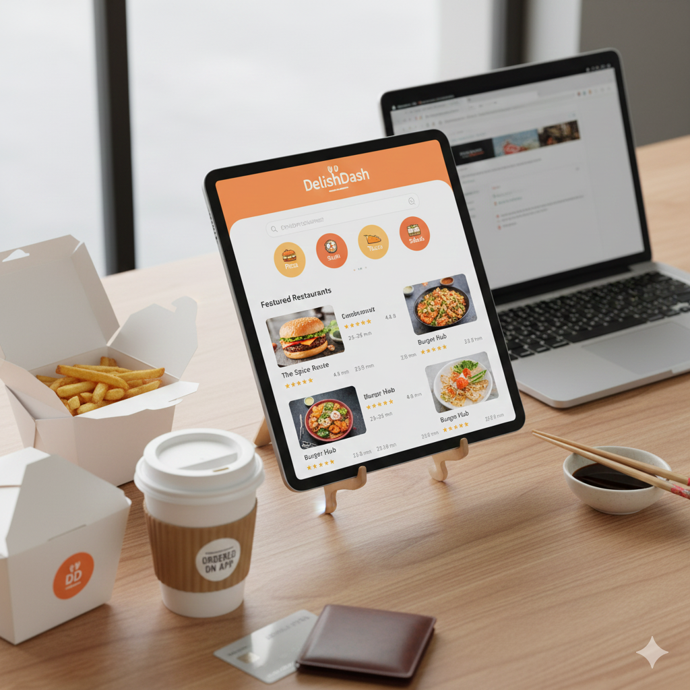

# Task 2 – Portfolio Website & Health Risk Projects

## Description
This folder contains my **portfolio project** along with health-related demo projects. It showcases my skills in HTML, CSS, and JavaScript, and also includes project screenshots, certificates, and other personal work.

---

## Projects & Files Overview

| File / Folder | Description |
|---------------|-------------|
| `index.html` | Main portfolio webpage. |
| `style.css` | Styling for the portfolio and projects. |
| `script.js` | JavaScript for interactive elements on the portfolio site. |
| `foodorder.png` | Screenshot/image related to a food ordering project. |
| `healthrisk.jpg` | Screenshot/image related to health risk assessment project. |
| `INTERNSHIP.pdf` | Internship certificate/document. |
| `nptelcertificate.pdf` | NPTEL certificate for a course completed. |
| `roshan_pic1.jpg` / `roshan_pic2.jpg` | Personal profile images for the portfolio. |
| `Roshan_Reddy_Resume.pdf` | My resume. |
| `tcsnqtitresult.pdf` | TCS iON NQT IT result certificate. |
| `.vscode/` | VS Code workspace configuration (optional, not needed for GitHub). |

---

## Features of the Portfolio

- **Personal Info & Resume:** Showcase of personal profile, resume, and certificates.
- **Projects:** Display of projects with screenshots, including:
  - Food ordering project
  - Health risk assessment project
- **Responsive Design:** Works well on desktop and mobile.
- **Interactive Elements:** Implemented via `script.js`.

---

## How to Run

1. Open the folder `Task2_Portfolio_Site`.
2. Open `index.html` in any modern web browser.
3. Navigate through the portfolio sections to view projects, certificates, and contact info.

---

## Technologies Used

- HTML5  
- CSS3  
- JavaScript (vanilla)  
- VS Code for development  

---
## Live Demo

[View Live Portfolio](https://codealphafrontend.netlify.app/)

## Future Improvements

- Make the portfolio **fully responsive** for all devices.
- Add **navigation bar animation** and smooth scrolling.
- Include **interactive project demos** (live previews of food ordering and health risk tools).
- Deploy the portfolio online using **GitHub Pages** or **Netlify**.

---

## Author

**Chinnakka Roshan Reddy**  
Frontend Developer | Portfolio & Projects  

---

## Screenshots / Demo

